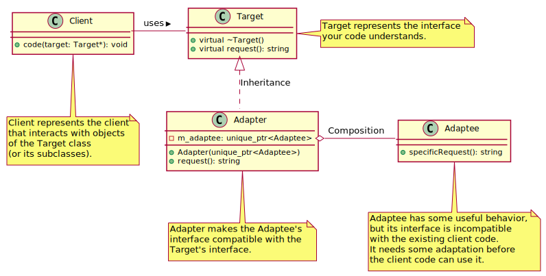

# Structural Pattern

## Adapter

The Adapter is a structural design pattern that allows objects with incompatible interfaces to work together. It acts as a wrapper between two objects, catching calls for one object and transforming them to format and interface recognizable to the second object.

This pattern is useful when you want to use an existing class, but its interface isn't compatible with the rest of your code. The Adapter pattern lets you create a middle-layer class that serves as a translator between your code and a legacy class, a 3rd party or any other class with a weird interface.

### Conceptual example

* [Code for 01-conceptual-example](01-adapter/01-conceptual-example/).
  
#### UML class diagram

<div hidden>
    ```
    @startuml adapterDiagram

    class Client {
    +code(target: Target*): void
    }

    class Target {
    +virtual ~Target()
    +virtual request(): string
    }

    class Adaptee {
    +specificRequest(): string
    }

    class Adapter {
    -m_adaptee: unique_ptr<Adaptee>
    +Adapter(unique_ptr<Adaptee>)
    +request(): string
    }

    Client -r- Target : uses >
    Target <|.d. Adapter : Inheritance
    Adapter o-r- Adaptee : Composition

    note right of Target
    Target represents the interface 
    your code understands.
    end note

    note bottom of Adaptee
    Adaptee has some useful behavior, 
    but its interface is incompatible 
    with the existing client code. 
    It needs some adaptation before 
    the client code can use it.
    end note

    note bottom of Adapter
    Adapter makes the Adaptee's 
    interface compatible with the 
    Target's interface.
    end note

    note bottom of Client
    Client represents the client
    that interacts with objects
    of the Target class
    (or its subclasses).
    end note

    @enduml
    ```
</div>




