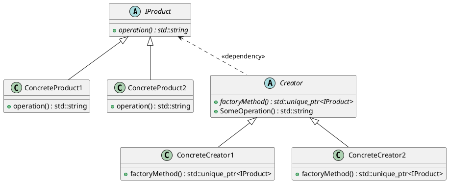
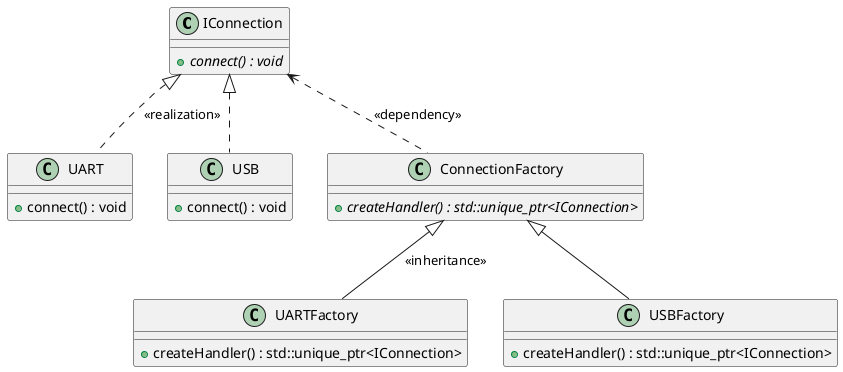

# Design Patterns in Modern C++

 

## 1. Creational patterns

### 1.1. Factory method

Factory Method is a creational design pattern that provides an interface for creating objects in a superclass, but allows subclasses to alter the type of objects that will be created.

* Encapsulates the creation of related objects.
* Provides an interface to create an object but defers the creation to subclasses.
* Extensible to include objects.

#### Conceptual example

* [Code for 01-conceptual-example](01-creational/01-factory-method/01-conceptual-example/).
  
##### UML class diagram

#### UART and USB example

* [Code for 02-uart-and-usb](01-creational/01-factory-method/02-uart-and-usb/)

##### UML class diagram

